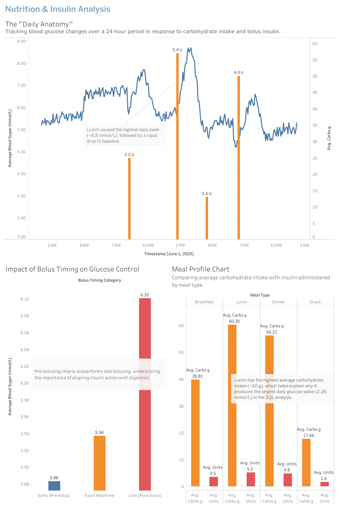
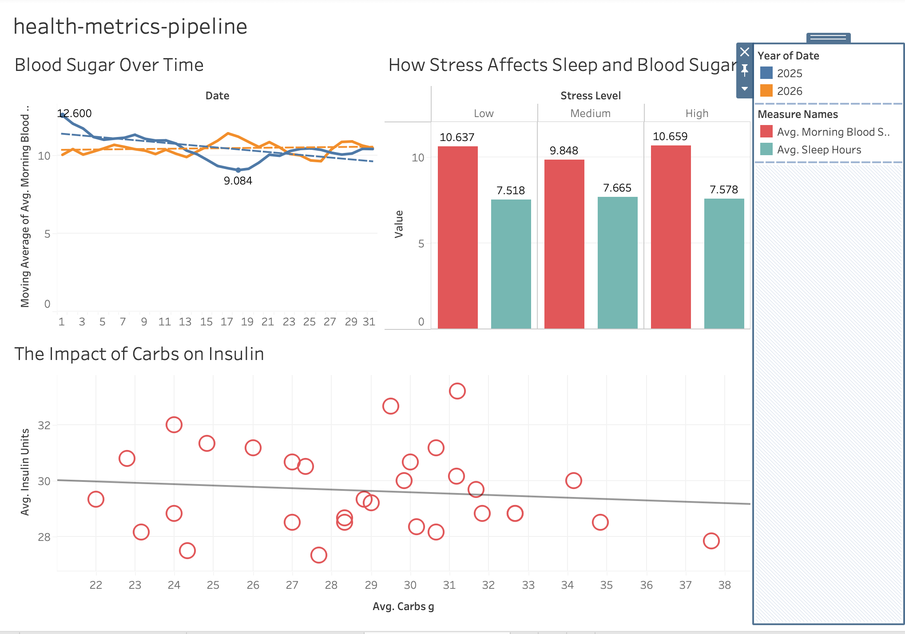

# health-metrics-pipeline
A data pipeline and analysis project tracking daily type 1 diabetic health metrics, including diet and blood sugar, using Python and SQL.

## Overview
The Health Metrics Pipeline is a data analysis project designed to reliably track, process, and analyze personal health data over time. By transforming raw health inputs into a structured database, this project extracts actionable insights and helps identify long-term health trends.

## The Motivation
When it comes to managing Type 1 Diabetes, data is everything. To maintain stable blood glucose levels, my partner follows a strict low-carb diet (under 40g of carbohydrates daily) and meticulously tracks protein and calorie intake. For a long time, I relied on complex spreadsheets to manage and analyze all of this information. However, as the variables grew, spreadsheets reached their limits. I built this pipeline because I needed a more robust, automated analytical tool to truly understand the complex trends and variables affecting daily health.

## The Data Challenge: Simulating T1D
Health data is incredibly sensitive, and I wanted to keep my partner's real medical data private. To share this project publicly, I built a custom Python generator to simulate realistic T1D mock data. Diabetes management isn't just about tracking carbs and insulin, so the generator had to factor in complex, real-world variables like sleep, stress, protein digestion curves, and sudden Continuous Glucose Monitor (CGM) drops. This ensures the dataset is authentically messy and realistic for analysis.

## Features
- Data Ingestion: Automated loading and normalization of raw health metrics.
- Data Cleaning & Processing: Python scripts that handle missing values and process raw inputs.
- Trend Analysis: Custom SQL queries designed to extract long-term health insights.
- Visualizations: Tableau dashboards for relational database vitals and insights.

## Dashboard & Visualizations
To make the simulated T1D data actionable, I connected the processed CSVs to Tableau to build an interactive monitoring dashboard. 

[](https://public.tableau.com/app/profile/yutong.lin7507/viz/health_metrics_pipeline_dashboard/NutritionInsulinAnalysis)

*< Click the image above to view the interactive dashboard on Tableau Public >*

### Key Dashboard Features:
- Daily Blood Glucose Trends: Visualizing the 24-hour curve, highlighting peaks and time in range.
- Insulin vs. Carbs: Tracking the bolus timing and its direct impact on post-meal spikes.
- Activity Impact: Filtering glucose trends by exercise intensity (Walk, Run, Strength).

### Iterative Development: Validating the Data

A big part of this project was making sure the generated data actually reflected realistic biological patterns.

At first, I built the mock data using simplified random distributions. But after visualizing the `v0` data in an early dashboard draft, I noticed some physiological patterns did not make sense. Some blood glucose trends did not match the expected effects of stress, sleep, carbohydrate intake, and insulin response. The scatter plot also showed a flat relationship between carbohydrate intake and insulin units, which is not realistic.


*Figure 1: The initial `v0` dashboard showed that the original Python generation rules were not biologically realistic.*

- The Solution: Once I saw the data quality issues, I scrapped the v0 dataset and rewrote the Python generation logic. I updated the model to better reflect real T1D behavior, including insulin sensitivity, carb-to-insulin ratios, and the impact of stress. The final interactive dashboard linked at the top of this section is built entirely on this improved v1 version.

## Tech Stack
* **Python:** Used for data manipulation, cleaning, and scripting (e.g., pandas).
* **SQL:** Used for relational database management and querying insights.
* **Tableau:** Used for building multi-workbook dashboards and visual analytics.

## Project Structure
```text
health-metrics-pipeline/
│
├── analyze_vitals/               # SQL scripts and indexing
├── dashboards/                   # Tableau workbook files (.twbx)
├── database/                     # Contains the generated SQLite database (v1-t1d_mock.db, ignored in git)
├── images/                       # Charts and screenshots for documentation
├── legacy_v0/                    # Previous raw and processed mock datasets
├── realistic_mock_data_v1/       # Python scripts: Robust v1 physiological logic
├── sample_data/                  # Lightweight CSV subsets for quick visualization
├── scripts/                      # General utility and data generation scripts
├── tableau_csv/                  # Full CSV exports feeding the Tableau dashboard
├── .gitignore                    # Specifies intentionally untracked files
├── README.md                     # Project documentation and roadmap
└── requirements.txt              # Python dependencies
```

# Project Roadmap: Advanced Biological Logic
To make the data generation and analysis as realistic as possible, I am actively building out the following logical rules into the Python pipeline:

# External Factors & Illness: 
Adding logic to handle everyday variables like caffeine (moderate insulin resistance) and different artificial sweeteners (since their effects vary). For illness, the model focuses on decreased insulin sensitivity and higher glucose as the main drivers, but it also accounts for sudden CGM drops and electrolyte loss from stomach issues.

- Macronutrient Tracking: Adding precise calorie and portion metrics.

- The Protein Curve: Accounting for protein's delayed impact on blood sugar, which typically peaks 1 to 2 hours post-ingestion and affects levels for up to 5 hours.

- Insulin Timing: Modeling the varied effects of administering insulin without food, or taking it hours before or after a meal.

- Device Mechanics: Simulating CGM recalibration events and data gaps.

## About me: 
   My background is rooted in Industrial Engineering and Business Management, with a focus on the practical application of data to drive business value. In my previous roles as a Data Analyst, I utilized ERP systems, Google Sheets, and SQL to manage a multi-channel business covering 12 retail stores, wholesale, and e-commerce operations. I take great pride in my ability to translate raw data into actionable management reports—a skill that previously resulted in a 5% reduction in operational errors and significantly improved inventory safety stock forecasting.

   After moving to Toronto, I dedicated my first few years to establishing my new life here and securing my Permanent Residency. During this time, I worked in the service industry, but I never stopped relying on data. I built complex tracking systems to manage my partner's health and continuously upskilled in tools like Python and SQL to meet the needs of the Canadian market.

   This project is a bridge back to my roots in the office, showcasing my ability to learn new technologies, build logical data models, and extract value from complex, messy variables. I am a data professional passionate about using analytics to solve real-world problems, and I am currently seeking opportunities to bring my organizational skills, resilience, and analytical mindset to a dedicated data team.
